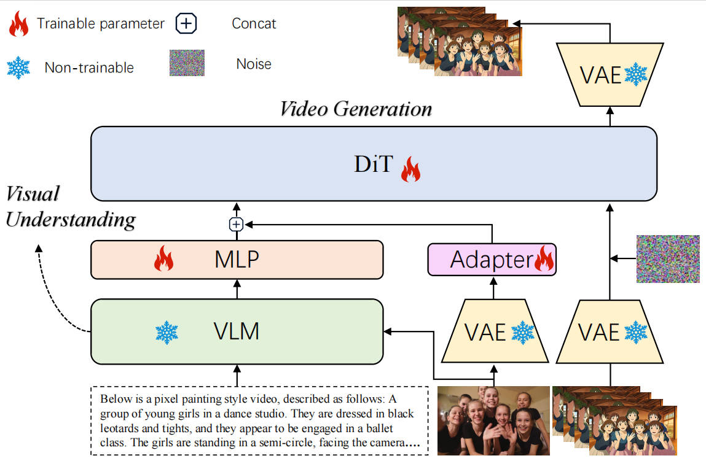
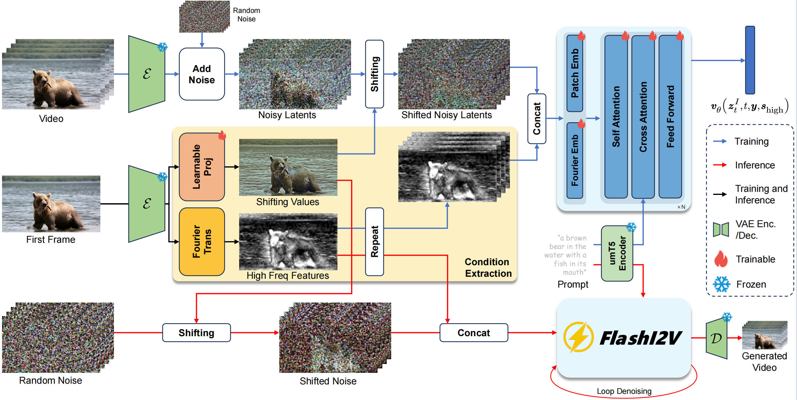

## Uniworld-OSP2.0 Report

2025年11月，我们在Fourier-Guided Latent Shifting I2V 框架的基础上，发布了 ​**Uniworld-OSP2.0**​。FlashI2V首次通过傅里叶指导的潜在空间位移（Latent Shifting）有效解决了现有I2V模型中条件图像泄漏的难题，确保了高保真度的运动和卓越的泛化能力。在 **Uniworld-OSP2.0** 中，我们引入了几个关键的更新：

1. FlashI2V 核心机制：采用傅里叶指导与潜在空间位移，有效避免了现有 I2V 模型常见的动作幅度小和色调不协调差的问题。
2. VLM 增强的统一条件编码机制：我们集成了​一个预训练的 70 亿参数量视觉语言模型（VLM）。通过 Adapter 模块将 VLM 输出的多模态特征融入 DiT 主干网络，该机制实现了对 VLM 语义理解能力的无损继承，取代了传统浅层文本编码器，极大地改善了生成模型的理解能力和生成可控性。
3. 统一的图像到风格化视频（I2SV）： 我们构建了一个包含 12 种独特艺术风格的全新风格化视频数据集，并扩展了框架能力，实现了从输入图像到指定艺术风格动态视频的生成。
4. 模型与数据的大规模扩展：我们将模型规模扩展到210 亿参数量​，结合大规模训练和架构增强，最终模型在I2V的六个关键评估指标上​超越 Wan2.1。

Uniworld-OSP2.0 全程在昇腾910系列加速卡上完成训练和推理。

### Open-Source Release

Uniworld-OSP2.0的开源计划包括：

1. 训练和推理代码。你也可以在[PKU-YUAN-Group/Uniworld-OSP2.0 | 魔乐社区](https://modelers.cn/models/PKU-YUAN-Group/Uniworld-OSP2.0)) 官方仓库找到 Uniworld-OSP2.0的NPU版本的实现。
2. Uniworld2.0的训练权重。
3. 12 种艺术风格的风格化视频数据集以及对应的描述信息。

## Detailed Technical Report

### 模型结构 —— Uniworld-OSP2.0

我们的工作旨在构建一个​既具备强语义理解能力，又具备高时空一致性与艺术多样性的视频生成框架​。为实现这一目标，我们从 FlashI2V 的基础能力出发，并在其优势之上进行系统扩展。

#### （1）FlashI2V 的核心优势

现有的I2V方法涉及条件图像泄漏。（a）有条件的图像泄漏会导致性能下降问题，其中视频是从具有Vbench-I2V文本图像对的Wan2.1-I2V-14B-480P中采样的。（b）在现有的I2V范式中，我们观察到域内数据的块式FVD随着时间的推移而增加，而域外数据的块化FVD始终保持较高水平，这表明现有范式在域内数据上学习的规律无法推广到域外数据。我们提出了FlashI2V隐式引入条件。我们使用可学习投影从条件图像潜伏中提取特征，然后进行潜伏移位，以获得隐含包含条件的更新中间状态。同时，条件图像潜伏期经过傅里叶变换以提取高频幅度特征作为指导，这些特征与噪声潜伏期连接并注入DiT。在推理过程中，我们从偏移的噪声开始，并在ODE之后逐渐去噪，最终解码视频。比较训练集和验证集上不同I2V范式的块式FVD变化模式，发现只有FlashI2V在两组中表现出相同的时间增加的FVD变异模式。这表明只有FlashI2V能够将从域内数据中学到的生成定律应用于域外数据。此外，FlashI2V具有最低的域外FVD，证明了其性能优势。

作为 Uniworld-OSP2.0 的基础，FlashI2V包含以下核心机制，旨在解决现有 I2V 模型的条件图像泄漏（Conditional Image Leakage）问题：

1. **潜在空间偏移（Latent Shifting）：** 通过修改流匹配分布来**隐式地**整合条件图像信息，从而减少去噪器对条件图像的过度依赖，从根本上缓解了泄漏，保证了高保真的运动。
2. **傅里叶引导（Fourier Guidance）：** 调节频率内容，通过傅里叶变换提取图像的高频幅度特征，并将其与噪声潜在空间拼接后馈入 DiT，用于稳定学习和校准细节。

FlashI2V 实现了：

* ​**输入参考图像不泄露到视频的像素层面**​（避免“一张图复制成一段视频”）
* ​**同时保持真实而流畅的运动轨迹**​（高时间一致性与高空间结构稳定性）

这意味着 FlashI2V 已具备较强的时序稳定性、动作可控性与角色一致性的基础能力。

#### （2）VLM 增强多模态条件模块 (VLM-Enhanced Multi-modal Conditioning Module)

针对传统 I2V 模型在语义理解深度和文本-图像跨模态控制能力方面的限制，我们引入了 VLM 增强条件机制 。该机制旨在利用高维多模态语义信息取代传统的​浅层文本特征，以实现更鲁棒、更精细的语义对齐。该模块将语义和视觉条件信息统一集成到视频生成过程中，包含以下2个核心分支：

##### 多模态语义条件分支（VLM 增强）

* **核心机制与创新点：**
  * 采用一个冻结的​预训练 VLM​（例如 Qwen2.5-VL，70 亿参数）作为核心​多模态特征提取器。
  * VLM 同时接收输入图像 ($I$) 和文本提示 ($T$)，综合生成包含复杂跨模态关系的​**语义丰富的多模态表示**​。
  * 这些鲁棒的 VLM 嵌入取代了传统模型中由 T5 编码器等产生的​浅层文本特征​，从条件输入上显著增强了模型的高级语义理解能力。
* **特征对齐：** VLM 输出的特征随后通过一个​轻量级可训练的 Adapter 模块（映射头），进行维度和表示空间的对齐，确保与 DiT 主干网络的输入兼容。

##### 首帧视觉潜在特征

* **作用：** 负责提供视频生成所需的**空间先验**和​**外观一致性**​。
* **机制：** 使用**冻结**的 VAE 图像编码器提取第一帧图像 (**\$I\_0\$**) 的潜在特征。该特征同样通过一个轻量级 MLP 映射到 DiT 空间。

最终的统一条件序列是通过拼接 VLM 映射特征（高维多模态语义）和首帧视觉潜在特征（外观先验）构建而成。该序列随后馈入 DiT 主干网络，通过交叉注意力机制有效地指导视频的条件去噪过程。这一创新设计使模型在语义空间中无损地继承 VLM 的强大视觉理解能力和​跨模态知识​，显著提升了 Uniworld-OSP2.0 的生成质量和可控性，具体体现在：

* **语义一致性：** 极大地增强了视频内容与文本描述之间的**匹配程度**和​**语义一致性**​，使得生成的视频与文本描述更加契合。
* **细粒度控制：** 提高了对角色、物体、动作、构图等**细粒度信息**的​**一致性控制能力**，解决了生成视频色调不协调的问题​。
* **动态描述：** 增强了对人物与场景动态的​**描述精度**，实现非慢动作视生成​。

#### （3）典型艺术风格化视频数据集构建

为了赋予模型更强的艺术表达能力、并实现统一的 Image-to-Stylized-Video Generation 能力，我们构建了一个大规模风格化视频数据集，覆盖 12 种典型艺术风格。该数据集旨在保证​风格表达的多样性与语义内容的可控性同时成立，而非仅仅追求视觉滤镜效果。在不改变主干模型结构的前提下，我们将风格作为独立但可组合的条件：

> 输入：原始图像 + 文本描述 + 目标风格
> 输出：时间连续且符合语义的风格化视频

我们从多个高质量视频素材源中收集原始真人/自然/城市/物体类视频，并经过多重过滤以保证内容质量：

* 移除低分辨率、强压缩与严重编码损坏的视频
* 过滤掉快速闪烁、极端变焦、镜头混剪等不利于模型学习时序规律的样本
* 控制内容分布以避免风格偏置集中于单类场景（如人物/静物/风景）

每个视频均具备稳定主体、完整动作过程与清晰时序结构，以避免“风格掩盖内容”或“训练成风格噪声”。
风格域并非仅基于颜色或滤镜，而从整体视觉组织方式出发构建，共 12 种，包括但不限于：

| 风格类型           | 特征                                 |
| -------------------- | -------------------------------------- |
| 油画、手绘、水彩   | 强笔触感、色彩建构主导、局部细节弱化 |
| 动漫、卡通、插画   | 轮廓边缘明显、色块分层、统一光照逻辑 |
| 哥特、暗黑、蒸汽波 | 复杂材质、跨域配色、结构抽象         |
| 赛博朋克、未来科幻 | 高饱和霓虹色、金属与光泽纹理         |

风格化视频并非直接使用风格化模型一次性生成，而采用回环式质量监控策略以保证可靠性：

1. 先由高质量图像风格化模型生成关键帧（多帧采样）
2. 再通过图像生成视频模型生成完整风格化视频
3. 对通过样本再次进行人工审核与语义验证

最终仅保留：风格稳定、主体完整、动作合理、时序连续的样本数据；

这一设计模式使 UniWorld-OSP2.0 可实现：

* 空间风格一致性（背景 / 容貌 / 材质多域一致）
* 时间风格一致性（笔触、色调随帧保持连续）
* 动作与语义永不被风格覆盖（避免 “角色变形” 与 “动作漂移”）

#### （4）基准表现：超越Wan2.1

##### 实验设置

为保证公平对比，我们在 250 万条内部高质量视频数据上训练模型 ​40K steps​，数据收集与预处理严格遵循 Open-Sora Plan的流程。每段视频均由 49 帧、16 fps、480×832 分辨率构成。

在训练架构方面：

* 可学习投影模块使用 **两层 Conv3D + SiLU**
* **Fourier 引导嵌入层**与 patch embedding 同构，并采用 **零初始化**
* 每段视频的 **首帧作为条件图像输入**
* Fourier 截断频率从 **U[0.05, 0.95]** 均匀采样
* 文本 Drop 概率 **0.1**

训练超参为：

| 参数          | 数值                         |
| --------------- | ------------------------------ |
| Batch size    | 64                           |
| Learning rate | 2e-5                         |
| Weight decay  | 1e-2                         |
| Optimizer     | AdamW (0.9, 0.999, ε=1e-15) |
| EMA           | 0.9999                       |

在消融实验中，我们将初始化规模降至1.3B​，在 200 万视频子集上训练 30K steps​，其余配置保持一致。

##### 采样设置

推理阶段采用 ​**Discrete Euler 采样器 + Sigma-Shifting 策略（HunyuanVideo）：

* Shifting 系数：7.0
* CFG scale：5.0
* 采样步数：50
* Fourier 截断频率固定为0.1

该策略稳定了时间一致性与内容保真度。

##### 评估设置

我们在默认分辨率下生成 49 帧视频​，并报告全部VBench-I2V 指标（不含 Camera Motion）​。
为提升指标可信度，VBench-I2V 的短文本提示均经ChatGPT 自动重写以提升语义清晰度。

消融实验方面：

* 从 OpenVid-1M 的高清子集随机采样1000 个视频作为验证集
* 计算chunk-wise FVD用于度量不同配置下的性能差异

通过大规模训练和架构增强，Uniworld-OSP2.0取得了卓越的性能，在6个关键指标上超越了 Wan2.1​。

| **Model**       | **I2V Paradigm**               | **Subject Consistency ↑** | **Background Consistency ↑** | **Motion Smoothness ↑** | **Dynamic Degree ↑** | **Aesthetic Quality ↑** | **Imaging Quality ↑** | **I2V Subject Consistency ↑** | **I2V Background Consistency ↑** |
| ----------------------- | -------------------------------------- | ---------------------------------- | ------------------------------------- | -------------------------------- | ----------------------------- | -------------------------------- | ------------------------------ | -------------------------------------- | ----------------------------------------- |
| SVD-XT-1.0 (1.5B)     | Repeating Concat and Adding Noise    | 95.52                            | 96.61                               | 98.09                          | 52.36                       | 60.15                          | 69.80                        | 97.52                                | 97.63                                   |
| SVD-XT-1.1 (1.5B)     | Repeating Concat and Adding Noise    | 95.42                            | 96.77                               | 98.12                          | 43.17                       | 60.23                          | 70.23                        | 97.51                                | 97.62                                   |
| SEINE-512x512 (1.8B)  | Inpainting                           | 95.28                            | 97.12                               | 97.12                          | 27.07                       | 64.55                          | 71.39                        | 97.15                                | 96.94                                   |
| CogVideoX-5B-I2V      | Zero-padding Concat and Adding Noise | 94.34                            | 96.42                               | 98.40                          | 33.17                       | 61.87                          | 70.01                        | 97.19                                | 96.74                                   |
| Wan2.1-I2V-14B-720P   | Inpainting                           | 94.86                            | 97.07                               | 97.90                          | 51.38                       | 64.75                          | 70.44                        | 96.95                                | 96.44                                   |
| CogVideoX1.5-5B-I2V   | Zero-padding Concat and Adding Noise | 95.04                            | 96.52                               | 98.47                          | 37.48                       | 62.68                          | 70.99                        | 97.78                                | 98.73                                   |
| Wan2.1-I2V-14B-480P   | Inpainting                           | 95.68                            | 97.44                               | 98.46                          | 45.20                       | 61.44                          | 70.37                        | 97.83                                | 99.08                                   |
| **Uniworld-OSP2.0** | FlashI2V                             | **96.21**                            | **97.71**                               | **98.47**                          | **46.10**                      | **66.55**                          | 70.57                        | **97.99**                                | 98.94                                   |

*注：以上为在关键评估指标上的对比， Uniworld-OSP2.0  在运动质量、图像保真度和语义一致性方面均表现出优越性。*

### Future Work

当前的视频生成方法普遍面临严重的效率瓶颈。即便配备高端硬件,生成几秒钟的视频也往往需要数十分钟的处理时间,这极大地限制了技术的实际应用价值。虽然生成质量在近年来有了显著提升,但漫长的处理时间仍然是阻碍其在实际工作流程中推广的关键障碍,且现有模型基本只能生成5～10秒的短视频。
为了突破这些限制,我们训练了一个规模比现有模型大10倍的实时视频生成模型——OSP-RealTime 14B。该模型在单块NVIDIA H100 GPU上实现了10fps的文本到视频推理速度。图XXX展示了实时长视频生成的效果实例。接下来,我们将基于Wan2.1-T2V介绍如何实现这一突破性目标:

(1) 无限视频生成策略
不同于现有方法通常采用滑动窗口机制(sliding window mechanism)并结合因果掩码(causal mask)将双向模型转换为自回归模型,我们将长视频生成重新定义为无限的视频续写任务。具体而言,我们将已生成的视频作为上下文,在时间维度上与当前的噪声潜变量(noise latent)进行拼接。这一策略能够最大程度地保留与预训练模型一致的推理范式,从而相比传统方法具有更高的质量下限。

(2) 实时生成加速方案
为实现实时视频生成,我们采用了三项关键优化措施。首先,我们将噪声潜变量的帧数从21帧降低至9帧,即每次续写生成9帧视频。由于注意力机制的计算复杂度为O(n²),这一调整能够显著降低每次前向传播所需的计算开销。其次,我们打破了传统方法在所有采样阶段保持全分辨率的做法,将推理过程划分为分辨率递增的多个阶段,遵循res₁ < res₂ < ... < resₙ的渐进式流程,进一步减少了推理开销。
最后,我们应用DMD技术将推理步数从50步大幅压缩至4步。通过以上优化策略的协同作用,我们在14B规模的模型上成功实现了实时视频生成。
